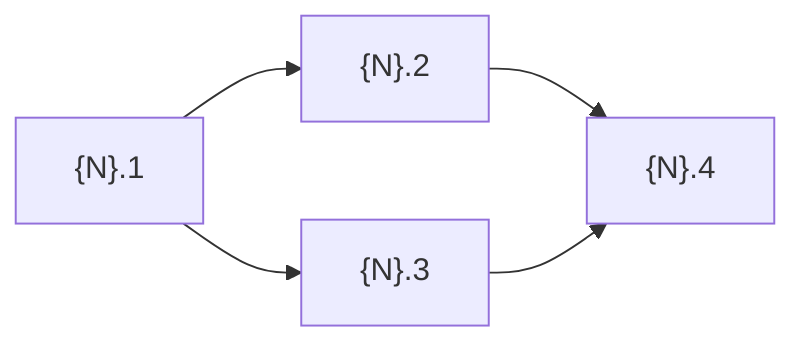

# Phase 4: Decomposition

<HARD-GATE>
Requires approved Phase 3 Design.
Read `.planning/active/03-design/index.md` — if not APPROVED, stop and complete Phase 3 first.
</HARD-GATE>

## What This Phase Produces

- Epic definition with goal and scope
- Stories with dependencies between them (`Depends on:`, `Wave:`)
- Sub-tasks per story — exact files, classes, actions for AI agent delegation
- Wave plan — which stories can execute in parallel

---

## Step 1: Context (Silent)

Read:
1. `.planning/active/01-analysis/index.md` — requirements
2. `.planning/active/03-design/index.md` — requirements traceability
3. `.planning/active/03-design/domain-map.md` — subdomains, impact
4. `.planning/active/03-design/data-model.md` — entities
5. `.planning/active/03-design/api-contracts.md` — endpoints
6. `.planning/STATE.md` — verify Phase 4

---

## Step 2: Epic Definition

Write `.planning/active/04-decomposition/epic.md`:

```markdown
# Epic: {Feature Name}

## Goal
{What this epic delivers, 2-3 sentences}

## Dependencies
- {External dependencies on other epics/features}

## Scope
| Area | Included |
|------|----------|
| {area} | {what's in scope} |

## Acceptance Criteria
- [ ] {epic-level criterion}
```

---

## Step 3: Story Decomposition

For each logical unit of work, create a story file in `.planning/active/04-decomposition/stories/`.

**Story format:**

```markdown
### Story {N}.{M}: {Name}
**Priority:** P0 / P1 / P2 | **Estimate:** {hours}h | **Wave:** {A/B/C}
**Spec:** {reference to Phase 3 design section}
**Depends on:** Story {X.Y} ({name}) | — (none)

> {Description: what this story delivers}

**Sub-tasks:**
- [ ] {N}.{M}.1 {Exact action with exact file path and class name}
- [ ] {N}.{M}.2 {Next action}
- [ ] {N}.{M}.3 {Next action}

**Acceptance Criteria:**
- [ ] {Testable criterion}
```

**Rules:**
- Each sub-task = one class/file/component (designed for AI agent delegation)
- Sub-tasks reference exact file paths from Phase 3 design
- `Depends on:` references other stories within this epic
- `Wave:` groups stories that can run in parallel
- Acceptance criteria must be testable (not "looks correct")

---

## Step 4: Sub-task Breakdown

For each story, write detailed sub-tasks. Each sub-task must have:
- Exact file path (create or modify)
- Exact class/interface/method name
- Clear action (what to do)
- Reference to Phase 3 design for details

**Anti-rationalization:**

| Excuse | Reality |
|--------|---------|
| "Sub-tasks are obvious from the story" | Agent needs exact file paths and class names. Be explicit. |
| "Too many sub-tasks" | Better too granular than too vague. Agent can combine. |
| "I'll figure out the details during implementation" | Details figured out during implementation = rework. Define now. |

---

## Step 5: Wave Plan

Write `.planning/active/04-decomposition/wave-plan.md`:

```markdown
# Wave Plan: {Feature Name}

## Wave A (no dependencies)
- Story {N}.1: {name} — foundation, blocks others

## Wave B (after Wave A)
- Story {N}.2: {name} ← ({N}.1)
- Story {N}.3: {name} ← ({N}.1)

## Wave C (after Wave B)
- Story {N}.4: {name} ← ({N}.2, {N}.3)

## Dependency Diagram


```

**Rules:**
- Wave A = stories with no dependencies (can start immediately)
- Each subsequent wave depends only on previous waves
- Stories within the same wave are independent (can run in parallel)
- Prefer vertical slices (entity+service+controller) over horizontal layers

---

## Step 6: Approval + Document

### 1. Write `.planning/active/04-decomposition/index.md`:

```markdown
# Phase 4: Decomposition — {Feature Name}

| Field    | Value                    |
|----------|--------------------------|
| Phase    | 4 of 9                  |
| Status   | APPROVED                |
| Date     | {YYYY-MM-DD}            |

## Summary
{Epic with N stories, M sub-tasks across K waves}

## Stories Overview

| # | Story | Priority | Wave | Depends On |
|---|-------|----------|------|------------|
| {N}.1 | {name} | P0 | A | — |
| {N}.2 | {name} | P0 | B | {N}.1 |

## Files in This Phase
- [epic.md](./epic.md)
- [stories/story-01-{slug}.md](./stories/story-01-{slug}.md)
- [wave-plan.md](./wave-plan.md)

## Gate
Approved → Phase 5: Validation
```

### 2. Present to user:

```
Decomposition saved to `.planning/active/04-decomposition/`.
{N} stories, {M} sub-tasks, {K} waves.

Please review. `approve` → Phase 5: Validation | `reject` → tell me what to fix.
```

<HARD-GATE>
Wait for explicit approval.
On approve → update STATE.md.
On reject → fix and re-present.
</HARD-GATE>

---

## Exit Criteria (ALL must be true)

- [ ] Epic definition written with goal and scope (Step 2)
- [ ] All stories have: acceptance criteria, depends on, wave, sub-tasks (Step 3)
- [ ] Sub-tasks reference exact file paths from Phase 3 design (Step 4)
- [ ] Wave plan written with dependency diagram (Step 5)
- [ ] All artifacts written to `.planning/active/04-decomposition/`
- [ ] User approved
- [ ] STATE.md updated
