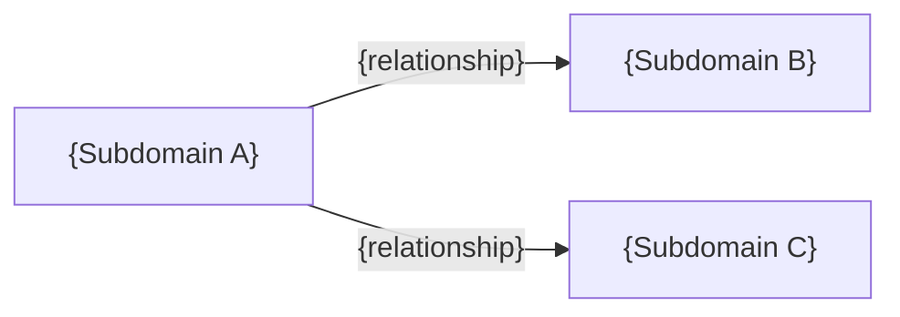

# Phase 3: Design

<HARD-GATE>
Requires approved Phase 2 Architecture.
Read `.planning/active/02-architecture/index.md` — if not APPROVED, stop and complete Phase 2 first.
No implementation until this phase is approved.
</HARD-GATE>

## What This Phase Covers (Micro — WITHIN the system)

- Domain map: subdomains, bounded contexts, relationships
- Data model: entities, fields, relations, migrations
- API contracts: endpoints, request/response DTOs, validation, status codes
- Requirements traceability: each requirement mapped to domain area

## What This Phase Does NOT Cover

- Macro architecture decisions (that was Phase 2)
- Task decomposition, stories, sub-tasks (that's Phase 4)
- Actual code implementation (that's Phase 6)

---

## Step 1: Context (Silent)

Read and internalize:

1. `.planning/active/01-analysis/index.md` — requirements, chosen approach
2. `.planning/active/02-architecture/index.md` — macro decisions
3. `.planning/active/02-architecture/tech-decisions.md` — ADRs
4. `.planning/active/02-architecture/integrations.md` — external services (if exists)
5. `.planning/STATE.md` — verify we're on Phase 3

**Do not show this step to the user.**

---

## Step 2: Domain Map

Map how the feature fits into the domain structure.

**For brownfield projects:**
- Identify which subdomains are affected (from existing codebase)
- Classify impact per subdomain: Major (new entities/services) / Minor (reuse existing) / None
- Map relationships between affected subdomains
- Show what's new vs what's existing

**For greenfield projects:**
- Define core subdomains and their responsibilities
- Define bounded contexts and relationships
- Identify which subdomain is the "core" (most business value)

Write to `.planning/active/03-design/domain-map.md`:

```markdown
# Domain Map: {Feature Name}

## Affected Subdomains

### {Subdomain Name} ({core/supporting/generic})
- **Responsibility:** {what this subdomain does}
- **Key entities:** {existing + new}
- **Impact:** Major / Minor / None
- **Relationship:** {how it connects to other subdomains}

## Subdomain Diagram



## New vs Existing

| Subdomain | Impact | What Changes |
|-----------|--------|--------------|
| {name} | Major | {new entity + service} |
| {name} | Minor | {reuse existing adapter} |
| {name} | None | {auto-scoped, no changes} |
```

---

## Step 3: Data Model

Design entities, fields, relations, and migrations.

**For each new or modified entity:**

```markdown
### {EntityName}

**Table:** `{table_name}`
**Layer:** `src/CarrierPlatform.Core/Entities/{EntityName}.cs`

| Field | Type | Nullable | Default | Notes |
|-------|------|----------|---------|-------|
| {field} | {type} | {yes/no} | {default} | {FK, index, etc.} |

**Relations:**
- {EntityName} → {OtherEntity} (one-to-many via {FK})

**Indexes:**
- {index description}

**Migration notes:**
- {what needs to change in DB}
```

**Rules (from AGENTS.md):**
- `DateTimeOffset` always, never `DateTime`
- Enum defaults: `HasDefaultValueSql("'value'::enum_type")` never `HasDefaultValue()`
- Credential values NEVER in entities/DTOs

Write to `.planning/active/03-design/data-model.md`.

---

## Step 4: API Contracts

Design endpoints, DTOs, validation, and response format.

**For each endpoint:**

```markdown
### {METHOD} {path}

**Purpose:** {what it does}
**Auth:** {required/optional/public}
**Layer:** Controller → Service → Repository

**Request:**
| Parameter | Location | Type | Required | Validation |
|-----------|----------|------|----------|------------|
| {param} | body/query/path | {type} | {yes/no} | {rules} |

**Response (success):**
```json
{
  "success": true,
  "data": { ... },
  "meta": { "request_id": "...", "pagination": { ... } }
}
```

**Response (error):**
| Status | Error Code | When |
|--------|-----------|------|
| 400 | VALIDATION_ERROR | {condition} |
| 404 | NOT_FOUND | {condition} |
| 409 | CONFLICT | {condition} |

**DTOs:**
- Request: `{DtoName}` — {fields}
- Response: `{DtoName}` — {fields}

**Validation (FluentValidation):**
- {rule}
```

**Rules (from AGENTS.md):**
- Snake_case JSON (`JsonNamingPolicy.SnakeCaseLower`)
- Standardized `ApiResponse<T>` envelope
- Credential values NEVER in response DTOs (only `IsSet` boolean)

Write to `.planning/active/03-design/api-contracts.md`.

---

## Step 5: Self-Review

Before presenting to user, check:

1. **Coverage:** Every Phase 1 requirement has a domain area, entity, or endpoint
2. **Consistency:** Entity fields match DTO fields match API contracts
3. **No placeholders:** No "TBD", "TODO", vague field types
4. **Conventions:** Design follows CLAUDE.md/AGENTS.md rules

Fix any issues found. Do not ask the user to review your self-review.

---

## Step 6: Approval + Document

### 1. Write `.planning/active/03-design/index.md`:

```markdown
# Phase 3: Design — {Feature Name}

| Field    | Value                    |
|----------|--------------------------|
| Phase    | 3 of 9                  |
| Status   | APPROVED                |
| Date     | {YYYY-MM-DD}            |

## Summary
{2-3 sentences: what was designed}

## Requirements Traceability

| Requirement | Domain Area | Entity | Endpoint |
|-------------|-------------|--------|----------|
| {req} | {subdomain} | {entity} | {endpoint} |

## Files in This Phase
- [domain-map.md](./domain-map.md) — subdomains, relationships, impact
- [data-model.md](./data-model.md) — entities, fields, relations, migrations
- [api-contracts.md](./api-contracts.md) — endpoints, DTOs, validation

## Gate
Approved → Phase 4: Decomposition
```

### 2. Present to user:

```
Design documented in `.planning/active/03-design/`.
{N} entities, {M} endpoints designed.

Please review. `approve` → Phase 4: Decomposition | `reject` → tell me what to fix.
```

<HARD-GATE>
Wait for explicit approval.
On approve → update STATE.md (Phase 3 completed, Phase 4 pending).
On reject → fix and re-present.
</HARD-GATE>

---

## Exit Criteria (ALL must be true)

- [ ] Domain map with subdomains, relationships, impact assessment (Step 2)
- [ ] Data model with entities, fields, relations, migrations (Step 3)
- [ ] API contracts with endpoints, DTOs, validation, response format (Step 4)
- [ ] Requirements traceability — every requirement mapped (Step 5)
- [ ] Self-review passed: no placeholders, consistent, conventions followed (Step 5)
- [ ] All artifacts written to `.planning/active/03-design/`
- [ ] User approved
- [ ] STATE.md updated

---

## Anti-Rationalization Table

| Excuse | Reality |
|--------|---------|
| "Entities are obvious from the analysis" | Obvious ≠ documented. Write them explicitly. |
| "API contracts can be figured out during coding" | Contracts decided during coding are inconsistent. Define now. |
| "The domain map is overkill for this feature" | Even small features touch multiple subdomains. Map them. |
| "I already know the data model" | Writing it down catches missing fields and relations. |
