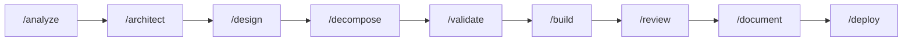

<p align="center">
  <h1 align="center">Ankach Dev Framework</h1>
  <p align="center">
    A 9-phase AI-assisted development pipeline for <a href="https://claude.ai/code">Claude Code</a>
    <br />
    <em>Skills, agents, and structured workflows for building software the right way</em>
  </p>
  <p align="center">
    <a href="#quick-start">Quick Start</a> &middot;
    <a href="docs/workflows.md">Workflows</a> &middot;
    <a href="docs/phases.md">9 Phases</a> &middot;
    <a href="docs/agents.md">Agents</a> &middot;
    <a href="docs/examples.md">Examples</a> &middot;
    <a href="docs/installation.md">Installation</a>
  </p>
</p>

---

## Why?

AI coding assistants are powerful but chaotic. They skip analysis, jump to code, miss edge cases, and produce inconsistent results. This framework adds structure:

- **Every feature goes through 9 phases** with documented artifacts
- **You control every step** via manual approval gates
- **Agents can't cut corners** thanks to anti-rationalization tables and hard gates
- **Nothing is lost** because every decision, approach, and trade-off is documented

Built by combining the best patterns from [Superpowers](https://github.com/obra/superpowers), [GSD](https://github.com/gsd-build/get-shit-done), [Everything Claude Code](https://github.com/affaan-m/everything-claude-code), and [Antigravity Awesome Skills](https://github.com/sickn33/antigravity-awesome-skills).

## Quick Start

```bash
# Clone the framework
git clone https://github.com/AAnkacHH/ankach-dev-framework.git

# Copy into your project
cp -r ankach-dev-framework/.claude/ your-project/.claude/

# Start building
cd your-project
```

```
# For a new feature on existing project:
/workflow-feature Add user authentication with OAuth

# For a new project from scratch:
/workflow-full Build a REST API for inventory management
```

## Pipeline



| # | Phase | Command | Purpose |
|---|-------|---------|---------|
| 1 | Analysis | `/analyze` | Understand the task, research, propose approaches |
| 2 | Architecture | `/architect` | Macro: servers, communication, technologies |
| 3 | Design | `/design` | Micro: domain map, entities, API contracts |
| 4 | Decomposition | `/decompose` | EPIC → STORIES → TASKS with wave plan |
| 5 | Validation | `/validate` | Architecture review + requirements coverage |
| 6 | Implementation | `/build` | Parallel agent execution, wave-by-wave |
| 7 | Review | `/review` | Spec compliance → Code quality → Tests |
| 8 | Documentation | `/document` | API docs, dev notes, changelog |
| 9 | Deploy | `/deploy` | Checklist, merge/PR, verify, archive |

## Conventions

- **Diagrams:** All diagrams use [Mermaid](https://mermaid.js.org/) syntax — never ASCII art. Before generating, verify current syntax via [context7](https://context7.com) (`/mermaid-js/mermaid`). See [Patterns](docs/patterns.md#mermaid-diagrams-all-phases) for details.

## Documentation

| Document | Description |
|----------|-------------|
| [Workflows](docs/workflows.md) | `/workflow-feature` vs `/workflow-full` — when to use which |
| [Phases](docs/phases.md) | Detailed description of all 9 phases with steps and artifacts |
| [Agents](docs/agents.md) | 5 agents with tools, models, roles, and deviation rules |
| [Examples](docs/examples.md) | 4 usage examples: brownfield, greenfield, single phase, resume |
| [Patterns](docs/patterns.md) | Hard gates, anti-rationalization, understanding lock, validation loops |
| [Installation](docs/installation.md) | Setup guide, CLAUDE.md configuration, file structure |
| [Inspiration](docs/inspiration.md) | What we took from Superpowers, GSD, ECC, Antigravity |

## License

MIT &copy; 2026 [Andrii Plyskach](https://github.com/AAnkacHH)
