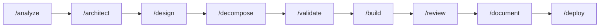

<p align="center">
  <h1 align="center">Ankach Dev Framework</h1>
  <p align="center">
    AI-assisted development workflows for <a href="https://claude.ai/code">Claude Code</a>
    <br />
    <em>Structured skills, agents, and commands — organized by workflow</em>
  </p>
  <p align="center">
    <a href="#workflows">Workflows</a> &middot;
    <a href="#utilities">Utilities</a> &middot;
    <a href="docs/patterns.md">Patterns</a> &middot;
    <a href="docs/examples.md">Examples</a> &middot;
    <a href="docs/installation.md">Installation</a>
  </p>
</p>

---

## Why?

AI coding assistants are powerful but chaotic. They skip analysis, jump to code, miss edge cases, and produce inconsistent results. This framework adds structure:

- **Every feature goes through defined phases** with documented artifacts
- **You control every step** via manual approval gates
- **Agents can't cut corners** thanks to anti-rationalization tables and hard gates
- **Nothing is lost** because every decision, approach, and trade-off is documented

Built by combining the best patterns from [Superpowers](https://github.com/obra/superpowers), [GSD](https://github.com/gsd-build/get-shit-done), [Everything Claude Code](https://github.com/affaan-m/everything-claude-code), and [Antigravity Awesome Skills](https://github.com/sickn33/antigravity-awesome-skills).

## Repository Structure

```
workflows/                         # Each workflow is a self-contained unit
├── dev-pipeline/                  # 9-phase development workflow
│   ├── README.md                  # Overview, diagram, contents
│   ├── workflow-full.md           # Orchestrator: greenfield
│   ├── workflow-feature.md        # Orchestrator: brownfield
│   ├── skills/                    # 9 phase skills
│   ├── commands/                  # 11 slash commands
│   └── agents/                    # 5 sub-agents
│
utilities/                         # Standalone tools (not workflows)
├── map-codebase/                  # Analyze and document a codebase
│
docs/                              # Framework documentation
```

## Workflows

| Workflow | Description | Skills | Agents | Commands |
|----------|-------------|--------|--------|----------|
| [dev-pipeline](workflows/dev-pipeline/) | 9-phase development workflow: analyze → architect → design → decompose → validate → build → review → document → deploy | 9 | 5 | 11 |



## Utilities

| Utility | Description |
|---------|-------------|
| [map-codebase](utilities/map-codebase/) | Analyze an existing codebase and generate `.context/` files |

## Conventions

- **Diagrams:** All diagrams use [Mermaid](https://mermaid.js.org/) syntax — never ASCII art. Before generating, verify current syntax via [context7](https://context7.com) (`/mermaid-js/mermaid`). See [Patterns](docs/patterns.md#mermaid-diagrams-all-phases) for details.

## Documentation

| Document | Description |
|----------|-------------|
| [Phases](docs/phases.md) | Detailed description of all 9 phases with steps and artifacts |
| [Agents](docs/agents.md) | 5 agents with tools, models, roles, and deviation rules |
| [Patterns](docs/patterns.md) | Hard gates, anti-rationalization, understanding lock, validation loops |
| [Examples](docs/examples.md) | 4 usage examples: brownfield, greenfield, single phase, resume |
| [Installation](docs/installation.md) | Setup guide, CLAUDE.md configuration, file structure |
| [Inspiration](docs/inspiration.md) | What we took from Superpowers, GSD, ECC, Antigravity |

## License

MIT &copy; 2026 [Andrii Plyskach](https://github.com/AAnkacHH)
