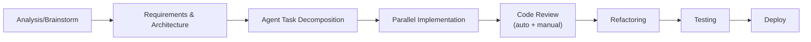
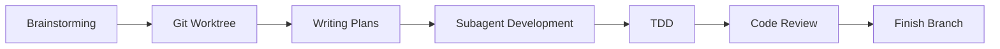

# Ankach Dev Framework — Архітектура та план впровадження

Персональний development workflow framework для Claude Code, натхненний Superpowers, адаптований під повний цикл розробки.

---

## Концепція

Superpowers — це plugin з фіксованим набором skills. Твій підхід інший: ти поступово додаєш skills і agents до кожного проєкту, зберігаючи їх у `.claude/` директорії. Технологічний стек описаний у `CLAUDE.md`, а skills працюють з будь-яким стеком.

**Твій pipeline:**



**Superpowers pipeline (для порівняння):**



**Що ми беремо з Superpowers:**
- Формат SKILL.md з чіткими кроками і decision diagrams
- Subagent isolation (fresh context per task)
- Two-stage review (spec compliance + code quality)
- Hard gates між фазами (не перескочити без approval)
- Mandatory skill invocation (якщо є skill — юзай його)

**Що додаємо своє:**
- Architecture Definition Phase (відсутня у Superpowers)
- Agent Task Decomposition (специфічні requirements для кожного агента)
- Manual Review Gate (Superpowers тільки автоматичний)
- Dedicated Refactoring Phase
- Deploy Pipeline як окремий skill

---

## Структура файлів (додається до існуючого проєкту)

```
your-project/
├── CLAUDE.md                          # Головні інструкції + стек
├── CLAUDE.local.md                    # Персональні override'и (gitignored)
│
├── .claude/
│   ├── settings.json                  # Permissions
│   ├── settings.local.json            # Персональні permissions
│   │
│   ├── skills/                        # === CORE SKILLS ===
│   │   ├── analysis/
│   │   │   └── SKILL.md               # Phase 1: Analysis & Brainstorm
│   │   ├── architecture/
│   │   │   └── SKILL.md               # Phase 2: Requirements & Architecture
│   │   ├── task-decomposition/
│   │   │   └── SKILL.md               # Phase 3: Agent Task Creation
│   │   ├── implementation/
│   │   │   └── SKILL.md               # Phase 4: Parallel Implementation
│   │   ├── code-review/
│   │   │   └── SKILL.md               # Phase 5: Auto + Manual Review
│   │   ├── refactoring/
│   │   │   └── SKILL.md               # Phase 6: Refactoring
│   │   ├── testing/
│   │   │   └── SKILL.md               # Phase 7: Automatic Testing
│   │   ├── deploy/
│   │   │   └── SKILL.md               # Phase 8: Deploy
│   │   └── debugging/
│   │       └── SKILL.md               # On-demand: Systematic Debugging
│   │
│   ├── agents/                        # === SUBAGENT PROMPTS ===
│   │   ├── implementer.md             # Імплементує конкретну задачу
│   │   ├── spec-reviewer.md           # Перевіряє відповідність специфікації
│   │   ├── code-quality-reviewer.md   # Перевіряє якість коду
│   │   ├── refactorer.md              # Спеціалізований рефакторинг
│   │   └── test-writer.md             # Пише тести
│   │
│   ├── commands/                      # === SLASH COMMANDS ===
│   │   ├── analyze.md                 # /analyze — запустити Phase 1
│   │   ├── plan.md                    # /plan — Phase 2+3
│   │   ├── build.md                   # /build — Phase 4
│   │   ├── review.md                  # /review — Phase 5
│   │   ├── refactor.md                # /refactor — Phase 6
│   │   ├── test.md                    # /test — Phase 7
│   │   └── deploy.md                  # /deploy — Phase 8
│   │
│   └── rules/                         # === MODULAR RULES ===
│       ├── code-style.md              # Стиль коду (бере з CLAUDE.md)
│       └── git-conventions.md         # Git workflow правила
│
├── docs/
│   └── specs/                         # Генеровані специфікації
│       └── YYYY-MM-DD-<feature>.md
│   └── plans/                         # Генеровані плани
│       └── YYYY-MM-DD-<feature>.md
│   └── reviews/                       # Результати рев'ю
│       └── YYYY-MM-DD-<feature>.md
```

---

## Phase 1: Analysis & Brainstorm

**Файл:** `.claude/skills/analysis/SKILL.md`

**Trigger:** "Let's build X", "I need a feature for...", "Analyze this problem..."

**Адаптовано з:** Superpowers `brainstorming` skill

**Кроки:**

1. **Explore Context** — прочитай CLAUDE.md, зрозумій стек і проєкт
2. **Assess Scope** — якщо проєкт великий → декомпозиція на під-проєкти
3. **Ask Questions** — по одному, prefer multiple choice
4. **Research** — якщо потрібно, зроби research (web, codebase)
5. **Propose 2-3 Approaches** — з trade-offs для кожного
6. **User Picks Approach** — HARD GATE: не рухайся далі без вибору
7. **Write Analysis Document** → `docs/specs/YYYY-MM-DD-<topic>-analysis.md`

**Hard Gate:** Жоден код, scaffold, або імплементація не починається до завершення цієї фази.

**Виходить у:** Phase 2 (architecture skill)

---

## Phase 2: Define Requirements & Architecture

**Файл:** `.claude/skills/architecture/SKILL.md`

**Trigger:** Автоматично після Phase 1 або "/plan"

**Це НОВЕ — Superpowers це не має окремо.**

**Кроки:**

1. **Read Analysis** — прочитай документ з Phase 1
2. **Define Functional Requirements** — що система повинна робити
3. **Define Non-Functional Requirements** — performance, security, scalability
4. **Design Architecture** — компоненти, інтерфейси, data flow
5. **Map Files** — які файли будуть створені/змінені, відповідальність кожного
6. **Define API Contracts** — якщо є endpoints, визнач контракти до імплементації
7. **User Reviews Architecture** — HARD GATE
8. **Write Architecture Document** → `docs/specs/YYYY-MM-DD-<topic>-architecture.md`

**Виходить у:** Phase 3 (task-decomposition skill)

---

## Phase 3: Create Agent Tasks

**Файл:** `.claude/skills/task-decomposition/SKILL.md`

**Адаптовано з:** Superpowers `writing-plans` skill

**Кроки:**

1. **Read Architecture** — прочитай документ з Phase 2
2. **Decompose into Tasks** — кожна задача 2-10 хвилин роботи агента
3. **Per Task Define:**
   - Exact file paths (create / modify)
   - Input: які файли/контексти потрібні агенту
   - Output: що агент повинен видати
   - Acceptance criteria: як перевірити що задача виконана
   - Dependencies: які задачі мають бути виконані першими
4. **Identify Parallel Groups** — які задачі можна виконувати паралельно
5. **Assign Agent Types** — implementer / test-writer / etc.
6. **User Reviews Plan** — HARD GATE
7. **Write Plan** → `docs/plans/YYYY-MM-DD-<feature>.md` з checkbox syntax

**Формат задачі в плані:**

```markdown
### Task 3: Create UserService

- **Agent:** implementer
- **Parallel Group:** B (can run with Task 4, 5)
- **Files:** src/Service/UserService.php (create)
- **Depends on:** Task 1 (Entity), Task 2 (Repository)
- **Context:** Read Entity and Repository from Tasks 1-2
- **Acceptance:**
  - [ ] Service створений з правильними dependencies
  - [ ] Методи createUser, updateUser, deleteUser імплементовані
  - [ ] Type hints на всіх параметрах і return types
  - [ ] Відповідає PSR-12 / Symfony conventions
```

**Виходить у:** Phase 4 (implementation skill)

---

## Phase 4: Parallel Agent Implementation

**Файл:** `.claude/skills/implementation/SKILL.md`

**Адаптовано з:** Superpowers `subagent-driven-development` + `dispatching-parallel-agents`

**Принцип:** Fresh subagent per task. Ізольований контекст. Агент отримує тільки те що йому потрібно.

**Кроки:**

1. **Read Plan** — один раз прочитай весь план
2. **Extract All Tasks** — створи TodoWrite з усіма задачами
3. **Per Parallel Group:**
   - Dispatch субагентів для всіх задач в групі
   - Кожен субагент отримує: task description + залежні файли + CLAUDE.md rules
   - Субагент: implement → self-test → self-review → commit
   - Субагент звітує: DONE / DONE_WITH_CONCERNS / BLOCKED / NEEDS_CONTEXT
4. **Handle Blocked** — дай більше контексту або розбий задачу
5. **Sequential Groups** — виконуй по порядку dependencies
6. **Mark Progress** — оновлюй checkboxes в плані

**Субагент Workflow (implementer.md):**

```
Read task requirements
  → Read CLAUDE.md code style rules
    → Implement
      → Run linter / static analysis
        → Self-review: "Would a staff engineer approve this?"
          → Commit with descriptive message
            → Report status
```

**Виходить у:** Phase 5 (code-review skill)

---

## Phase 5: Code Review (Auto + Manual)

**Файл:** `.claude/skills/code-review/SKILL.md`

**Адаптовано з:** Superpowers `requesting-code-review` (two-stage review)

**Stage 1: Spec Compliance Review (auto)**
- Субагент `spec-reviewer.md` перевіряє кожну задачу:
  - Чи всі acceptance criteria виконані?
  - Чи немає зайвого коду (scope creep)?
  - Чи API contracts дотримані?
- Результат: PASS / FAIL з конкретними issues

**Stage 2: Code Quality Review (auto)**
- Субагент `code-quality-reviewer.md` перевіряє:
  - SOLID principles
  - Code style (PSR-12 / Symfony / ESLint)
  - Security (SQL injection, XSS, CSRF)
  - Performance (N+1 queries, unnecessary loops)
  - Naming conventions
  - Error handling
- Severity: CRITICAL (блокує) / WARNING / SUGGESTION

**Stage 3: Manual Review Gate**
- Підготуй summary для людини:
  - Diff overview
  - Auto-review results
  - Flagged areas for human attention
- **HARD GATE:** Чекай approval від людини
- Людина може: approve / request changes / ask questions

**Write Review** → `docs/reviews/YYYY-MM-DD-<feature>.md`

**Виходить у:** Phase 6 (refactoring) або назад у Phase 4 (якщо changes requested)

---

## Phase 6: Refactoring

**Файл:** `.claude/skills/refactoring/SKILL.md`

**Це НОВЕ — Superpowers об'єднує це з TDD cycle.**

**Trigger:** Після code review або на вимогу (/refactor)

**Кроки:**

1. **Read Review Results** — що потребує рефакторингу
2. **Categorize:**
   - Must-fix (з review)
   - Should-improve (code quality suggestions)
   - Nice-to-have (elegance)
3. **Per Refactoring Task:**
   - Субагент `refactorer.md` отримує: поточний код + review feedback + rules
   - Рефакторить → verifies existing tests still pass → commits
4. **Verify No Regression** — run full test suite
5. **Quick Re-review** — лайтовий review рефакторингу

**Виходить у:** Phase 7 (testing)

---

## Phase 7: Automatic Testing

**Файл:** `.claude/skills/testing/SKILL.md`

**Адаптовано з:** Superpowers `test-driven-development` (але ми не завжди TDD)

**Два режими:**

**Mode A: TDD (якщо нова фіча з нуля)**
- RED: напиши тест що фейлить
- GREEN: мінімальний код щоб пройшов
- REFACTOR: покращ зберігаючи тести зеленими
- Commit після кожного GREEN

**Mode B: Post-Implementation Testing (якщо вже є код)**
- Аналізуй покриття: які paths не покриті
- Субагент `test-writer.md` пише:
  - Unit tests для кожного сервісу/компонента
  - Integration tests для API endpoints
  - Edge cases і error scenarios
- Run full suite
- Report coverage

**Stack-specific (визначається з CLAUDE.md):**
- PHP/Symfony → PHPUnit + PHPStan
- NestJS → Jest
- Vue.js → Vitest + Vue Test Utils
- .NET → xUnit

**Виходить у:** Phase 8 (deploy)

---

## Phase 8: Deploy

**Файл:** `.claude/skills/deploy/SKILL.md`

**Кроки:**

1. **Pre-deploy Checklist:**
   - [ ] Всі тести проходять
   - [ ] Code review approved
   - [ ] No CRITICAL issues в review
   - [ ] Environment variables перевірені
   - [ ] Database migrations готові (якщо є)
   - [ ] CHANGELOG оновлений
2. **Merge Strategy:**
   - Create PR / merge to main
   - Squash або merge commit (configurable в CLAUDE.md)
3. **Deploy Command:**
   - Stack-specific (Coolify, Docker, bare metal)
   - Визначається в CLAUDE.md
4. **Post-deploy Verification:**
   - Smoke tests
   - Health check endpoints
   - Log monitoring (перші 5 хвилин)

---

## CLAUDE.md Template

```markdown
# Project: [Name]

## Stack
- Language: PHP 8.3
- Framework: Symfony 7
- Frontend: Vue.js 3 + TypeScript
- Database: PostgreSQL 16
- ORM: Doctrine
- Testing: PHPUnit, PHPStan level 8, Vitest
- Deploy: Coolify on Hetzner CX33

## Code Style
- PSR-12 + Symfony coding standards
- SOLID principles
- KISS > DRY > YAGNI
- Type hints everywhere (strict_types=1)
- Final classes by default
- Readonly properties where possible

## Git
- Branch naming: feature/TICKET-description
- Commit messages: conventional commits
- Squash merge to main

## Architecture
- DDD-lite (Entity, Repository, Service layers)
- No anemic models
- DTOs for data transfer between layers
- Events for cross-domain communication

## Skills Workflow
- MANDATORY: Analysis → Architecture → Tasks → Implementation → Review → Refactor → Test → Deploy
- Hard gates between phases (no skipping)
- All skills in .claude/skills/ are MANDATORY when triggered
- Subagents get ONLY task-specific context + this file's rules
```

---

## План впровадження (поступовий)

### Week 1: Foundation
- [ ] Створити структуру `.claude/skills/` і `.claude/agents/`
- [ ] Написати `CLAUDE.md` для одного проєкту
- [ ] Створити Phase 1 skill (`analysis/SKILL.md`)
- [ ] Створити Phase 2 skill (`architecture/SKILL.md`)
- [ ] Протестувати на реальній задачі

### Week 2: Implementation Pipeline
- [ ] Створити Phase 3 skill (`task-decomposition/SKILL.md`)
- [ ] Створити Phase 4 skill (`implementation/SKILL.md`)
- [ ] Написати `agents/implementer.md`
- [ ] Протестувати parallel execution

### Week 3: Quality Gates
- [ ] Створити Phase 5 skill (`code-review/SKILL.md`)
- [ ] Написати `agents/spec-reviewer.md` і `agents/code-quality-reviewer.md`
- [ ] Створити Phase 6 skill (`refactoring/SKILL.md`)
- [ ] Написати `agents/refactorer.md`

### Week 4: Testing & Deploy
- [ ] Створити Phase 7 skill (`testing/SKILL.md`)
- [ ] Написати `agents/test-writer.md`
- [ ] Створити Phase 8 skill (`deploy/SKILL.md`)
- [ ] Створити slash commands (`/analyze`, `/plan`, `/build`, etc.)

### Week 5+: Iterate
- [ ] Зібрати lessons learned
- [ ] Оптимізувати prompts агентів
- [ ] Додати debugging skill
- [ ] Адаптувати для інших проєктів (копіюй `.claude/` + змінюй `CLAUDE.md`)

---

## Ключові відмінності від Superpowers

| Aspect | Superpowers | Твій Framework |
|--------|------------|----------------|
| Format | Plugin (global) | Per-project `.claude/` |
| Architecture phase | Немає (brainstorm → plan) | Окрема фаза з API contracts |
| Manual review | Немає явного | Hard gate з summary |
| Refactoring | Частина TDD cycle | Окрема фаза після review |
| TDD | Завжди обов'язковий | Два режими: TDD або post-impl |
| Deploy | Немає | Повний checklist + automation |
| Tech specifics | У skill files | Тільки в CLAUDE.md (skills tech-agnostic) |
| Sharing | Plugin marketplace | Copy `.claude/` між проєктами |