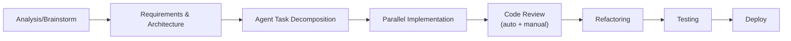
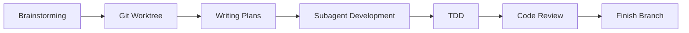

# Ankach Dev Framework — Architecture & Implementation Plan

Personal development workflow framework for Claude Code, inspired by Superpowers, adapted for a full development cycle.

---

## Concept

Superpowers is a plugin with a fixed set of skills. This approach is different: you incrementally add skills and agents to each project, storing them in the `.claude/` directory. The tech stack is described in `CLAUDE.md`, and skills work with any stack.

**Your pipeline:**



**Superpowers pipeline (for comparison):**



**What we take from Superpowers:**
- SKILL.md format with clear steps and decision diagrams
- Subagent isolation (fresh context per task)
- Two-stage review (spec compliance + code quality)
- Hard gates between phases (no skipping without approval)
- Mandatory skill invocation (if a skill exists — use it)

**What we add:**
- Architecture Definition Phase (absent in Superpowers)
- Agent Task Decomposition (specific requirements for each agent)
- Manual Review Gate (Superpowers only has automatic)
- Dedicated Refactoring Phase
- Deploy Pipeline as a separate skill

---

## File Structure (added to an existing project)

```
your-project/
├── CLAUDE.md                          # Main instructions + stack
├── CLAUDE.local.md                    # Personal overrides (gitignored)
│
├── .claude/
│   ├── settings.json                  # Permissions
│   ├── settings.local.json            # Personal permissions
│   │
│   ├── skills/                        # === CORE SKILLS ===
│   │   ├── analysis/
│   │   │   └── SKILL.md               # Phase 1: Analysis & Brainstorm
│   │   ├── architecture/
│   │   │   └── SKILL.md               # Phase 2: Requirements & Architecture
│   │   ├── task-decomposition/
│   │   │   └── SKILL.md               # Phase 3: Agent Task Creation
│   │   ├── implementation/
│   │   │   └── SKILL.md               # Phase 4: Parallel Implementation
│   │   ├── code-review/
│   │   │   └── SKILL.md               # Phase 5: Auto + Manual Review
│   │   ├── refactoring/
│   │   │   └── SKILL.md               # Phase 6: Refactoring
│   │   ├── testing/
│   │   │   └── SKILL.md               # Phase 7: Automatic Testing
│   │   ├── deploy/
│   │   │   └── SKILL.md               # Phase 8: Deploy
│   │   └── debugging/
│   │       └── SKILL.md               # On-demand: Systematic Debugging
│   │
│   ├── agents/                        # === SUBAGENT PROMPTS ===
│   │   ├── implementer.md             # Implements a specific task
│   │   ├── spec-reviewer.md           # Checks spec compliance
│   │   ├── code-quality-reviewer.md   # Checks code quality
│   │   ├── refactorer.md              # Specialized refactoring
│   │   └── test-writer.md             # Writes tests
│   │
│   ├── commands/                      # === SLASH COMMANDS ===
│   │   ├── analyze.md                 # /analyze — run Phase 1
│   │   ├── plan.md                    # /plan — Phase 2+3
│   │   ├── build.md                   # /build — Phase 4
│   │   ├── review.md                  # /review — Phase 5
│   │   ├── refactor.md                # /refactor — Phase 6
│   │   ├── test.md                    # /test — Phase 7
│   │   └── deploy.md                  # /deploy — Phase 8
│   │
│   └── rules/                         # === MODULAR RULES ===
│       ├── code-style.md              # Code style (from CLAUDE.md)
│       └── git-conventions.md         # Git workflow rules
│
├── docs/
│   └── specs/                         # Generated specifications
│       └── YYYY-MM-DD-<feature>.md
│   └── plans/                         # Generated plans
│       └── YYYY-MM-DD-<feature>.md
│   └── reviews/                       # Review results
│       └── YYYY-MM-DD-<feature>.md
```

---

## Phase 1: Analysis & Brainstorm

**File:** `.claude/skills/analysis/SKILL.md`

**Trigger:** "Let's build X", "I need a feature for...", "Analyze this problem..."

**Adapted from:** Superpowers `brainstorming` skill

**Steps:**

1. **Explore Context** — read CLAUDE.md, understand the stack and project
2. **Assess Scope** — if the project is large → decompose into sub-projects
3. **Ask Questions** — one at a time, prefer multiple choice
4. **Research** — if needed, do research (web, codebase)
5. **Propose 2-3 Approaches** — with trade-offs for each
6. **User Picks Approach** — HARD GATE: do not proceed without a choice
7. **Write Analysis Document** → `docs/specs/YYYY-MM-DD-<topic>-analysis.md`

**Hard Gate:** No code, scaffold, or implementation starts until this phase is complete.

**Leads to:** Phase 2 (architecture skill)

---

## Phase 2: Define Requirements & Architecture

**File:** `.claude/skills/architecture/SKILL.md`

**Trigger:** Automatically after Phase 1 or "/plan"

**This is NEW — Superpowers does not have this as a separate phase.**

**Steps:**

1. **Read Analysis** — read the document from Phase 1
2. **Define Functional Requirements** — what the system must do
3. **Define Non-Functional Requirements** — performance, security, scalability
4. **Design Architecture** — components, interfaces, data flow
5. **Map Files** — which files will be created/modified, each one's responsibility
6. **Define API Contracts** — if there are endpoints, define contracts before implementation
7. **User Reviews Architecture** — HARD GATE
8. **Write Architecture Document** → `docs/specs/YYYY-MM-DD-<topic>-architecture.md`

**Leads to:** Phase 3 (task-decomposition skill)

---

## Phase 3: Create Agent Tasks

**File:** `.claude/skills/task-decomposition/SKILL.md`

**Adapted from:** Superpowers `writing-plans` skill

**Steps:**

1. **Read Architecture** — read the document from Phase 2
2. **Decompose into Tasks** — each task is 2-10 minutes of agent work
3. **Per Task Define:**
   - Exact file paths (create / modify)
   - Input: which files/contexts the agent needs
   - Output: what the agent must produce
   - Acceptance criteria: how to verify the task is done
   - Dependencies: which tasks must be completed first
4. **Identify Parallel Groups** — which tasks can run in parallel
5. **Assign Agent Types** — implementer / test-writer / etc.
6. **User Reviews Plan** — HARD GATE
7. **Write Plan** → `docs/plans/YYYY-MM-DD-<feature>.md` with checkbox syntax

**Task format in the plan:**

```markdown
### Task 3: Create UserService

- **Agent:** implementer
- **Parallel Group:** B (can run with Task 4, 5)
- **Files:** src/Service/UserService.php (create)
- **Depends on:** Task 1 (Entity), Task 2 (Repository)
- **Context:** Read Entity and Repository from Tasks 1-2
- **Acceptance:**
  - [ ] Service created with correct dependencies
  - [ ] Methods createUser, updateUser, deleteUser implemented
  - [ ] Type hints on all parameters and return types
  - [ ] Follows PSR-12 / Symfony conventions
```

**Leads to:** Phase 4 (implementation skill)

---

## Phase 4: Parallel Agent Implementation

**File:** `.claude/skills/implementation/SKILL.md`

**Adapted from:** Superpowers `subagent-driven-development` + `dispatching-parallel-agents`

**Principle:** Fresh subagent per task. Isolated context. The agent receives only what it needs.

**Steps:**

1. **Read Plan** — read the entire plan once
2. **Extract All Tasks** — create TodoWrite with all tasks
3. **Per Parallel Group:**
   - Dispatch subagents for all tasks in the group
   - Each subagent receives: task description + dependent files + CLAUDE.md rules
   - Subagent: implement → self-test → self-review → commit
   - Subagent reports: DONE / DONE_WITH_CONCERNS / BLOCKED / NEEDS_CONTEXT
4. **Handle Blocked** — provide more context or split the task
5. **Sequential Groups** — execute in dependency order
6. **Mark Progress** — update checkboxes in the plan

**Subagent Workflow (implementer.md):**

```
Read task requirements
  → Read CLAUDE.md code style rules
    → Implement
      → Run linter / static analysis
        → Self-review: "Would a staff engineer approve this?"
          → Commit with descriptive message
            → Report status
```

**Leads to:** Phase 5 (code-review skill)

---

## Phase 5: Code Review (Auto + Manual)

**File:** `.claude/skills/code-review/SKILL.md`

**Adapted from:** Superpowers `requesting-code-review` (two-stage review)

**Stage 1: Spec Compliance Review (auto)**
- Subagent `spec-reviewer.md` checks each task:
  - Are all acceptance criteria met?
  - Is there any extra code (scope creep)?
  - Are API contracts followed?
- Result: PASS / FAIL with specific issues

**Stage 2: Code Quality Review (auto)**
- Subagent `code-quality-reviewer.md` checks:
  - SOLID principles
  - Code style (PSR-12 / Symfony / ESLint)
  - Security (SQL injection, XSS, CSRF)
  - Performance (N+1 queries, unnecessary loops)
  - Naming conventions
  - Error handling
- Severity: CRITICAL (blocks) / WARNING / SUGGESTION

**Stage 3: Manual Review Gate**
- Prepare a summary for the human:
  - Diff overview
  - Auto-review results
  - Flagged areas for human attention
- **HARD GATE:** Wait for approval from the human
- The human can: approve / request changes / ask questions

**Write Review** → `docs/reviews/YYYY-MM-DD-<feature>.md`

**Leads to:** Phase 6 (refactoring) or back to Phase 4 (if changes requested)

---

## Phase 6: Refactoring

**File:** `.claude/skills/refactoring/SKILL.md`

**This is NEW — Superpowers combines this with the TDD cycle.**

**Trigger:** After code review or on demand (/refactor)

**Steps:**

1. **Read Review Results** — what needs refactoring
2. **Categorize:**
   - Must-fix (from review)
   - Should-improve (code quality suggestions)
   - Nice-to-have (elegance)
3. **Per Refactoring Task:**
   - Subagent `refactorer.md` receives: current code + review feedback + rules
   - Refactors → verifies existing tests still pass → commits
4. **Verify No Regression** — run full test suite
5. **Quick Re-review** — lightweight review of the refactoring

**Leads to:** Phase 7 (testing)

---

## Phase 7: Automatic Testing

**File:** `.claude/skills/testing/SKILL.md`

**Adapted from:** Superpowers `test-driven-development` (but we don't always do TDD)

**Two modes:**

**Mode A: TDD (when building a new feature from scratch)**
- RED: write a failing test
- GREEN: minimal code to make it pass
- REFACTOR: improve while keeping tests green
- Commit after each GREEN

**Mode B: Post-Implementation Testing (when code already exists)**
- Analyze coverage: which paths are not covered
- Subagent `test-writer.md` writes:
  - Unit tests for each service/component
  - Integration tests for API endpoints
  - Edge cases and error scenarios
- Run full suite
- Report coverage

**Stack-specific (determined from CLAUDE.md):**
- PHP/Symfony → PHPUnit + PHPStan
- NestJS → Jest
- Vue.js → Vitest + Vue Test Utils
- .NET → xUnit

**Leads to:** Phase 8 (deploy)

---

## Phase 8: Deploy

**File:** `.claude/skills/deploy/SKILL.md`

**Steps:**

1. **Pre-deploy Checklist:**
   - [ ] All tests pass
   - [ ] Code review approved
   - [ ] No CRITICAL issues in review
   - [ ] Environment variables verified
   - [ ] Database migrations ready (if any)
   - [ ] CHANGELOG updated
2. **Merge Strategy:**
   - Create PR / merge to main
   - Squash or merge commit (configurable in CLAUDE.md)
3. **Deploy Command:**
   - Stack-specific (Coolify, Docker, bare metal)
   - Defined in CLAUDE.md
4. **Post-deploy Verification:**
   - Smoke tests
   - Health check endpoints
   - Log monitoring (first 5 minutes)

---

## CLAUDE.md Template

```markdown
# Project: [Name]

## Stack
- Language: PHP 8.3
- Framework: Symfony 7
- Frontend: Vue.js 3 + TypeScript
- Database: PostgreSQL 16
- ORM: Doctrine
- Testing: PHPUnit, PHPStan level 8, Vitest
- Deploy: Coolify on Hetzner CX33

## Code Style
- PSR-12 + Symfony coding standards
- SOLID principles
- KISS > DRY > YAGNI
- Type hints everywhere (strict_types=1)
- Final classes by default
- Readonly properties where possible

## Git
- Branch naming: feature/TICKET-description
- Commit messages: conventional commits
- Squash merge to main

## Architecture
- DDD-lite (Entity, Repository, Service layers)
- No anemic models
- DTOs for data transfer between layers
- Events for cross-domain communication

## Skills Workflow
- MANDATORY: Analysis → Architecture → Tasks → Implementation → Review → Refactor → Test → Deploy
- Hard gates between phases (no skipping)
- All skills in .claude/skills/ are MANDATORY when triggered
- Subagents get ONLY task-specific context + this file's rules
```

---

## Implementation Plan (gradual)

### Week 1: Foundation
- [ ] Create `.claude/skills/` and `.claude/agents/` structure
- [ ] Write `CLAUDE.md` for one project
- [ ] Create Phase 1 skill (`analysis/SKILL.md`)
- [ ] Create Phase 2 skill (`architecture/SKILL.md`)
- [ ] Test on a real task

### Week 2: Implementation Pipeline
- [ ] Create Phase 3 skill (`task-decomposition/SKILL.md`)
- [ ] Create Phase 4 skill (`implementation/SKILL.md`)
- [ ] Write `agents/implementer.md`
- [ ] Test parallel execution

### Week 3: Quality Gates
- [ ] Create Phase 5 skill (`code-review/SKILL.md`)
- [ ] Write `agents/spec-reviewer.md` and `agents/code-quality-reviewer.md`
- [ ] Create Phase 6 skill (`refactoring/SKILL.md`)
- [ ] Write `agents/refactorer.md`

### Week 4: Testing & Deploy
- [ ] Create Phase 7 skill (`testing/SKILL.md`)
- [ ] Write `agents/test-writer.md`
- [ ] Create Phase 8 skill (`deploy/SKILL.md`)
- [ ] Create slash commands (`/analyze`, `/plan`, `/build`, etc.)

### Week 5+: Iterate
- [ ] Collect lessons learned
- [ ] Optimize agent prompts
- [ ] Add debugging skill
- [ ] Adapt for other projects (copy `.claude/` + modify `CLAUDE.md`)

---

## Key Differences from Superpowers

| Aspect | Superpowers | This Framework |
|--------|------------|----------------|
| Format | Plugin (global) | Per-project `.claude/` |
| Architecture phase | None (brainstorm → plan) | Separate phase with API contracts |
| Manual review | No explicit gate | Hard gate with summary |
| Refactoring | Part of TDD cycle | Separate phase after review |
| TDD | Always mandatory | Two modes: TDD or post-impl |
| Deploy | None | Full checklist + automation |
| Tech specifics | In skill files | Only in CLAUDE.md (skills are tech-agnostic) |
| Sharing | Plugin marketplace | Copy `.claude/` between projects |
