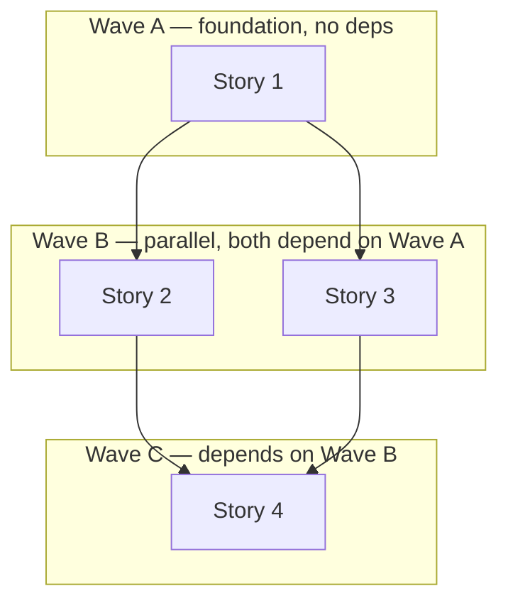
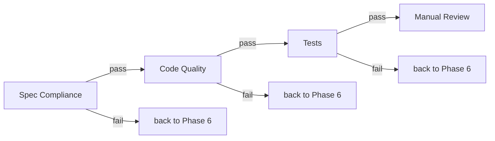

# Key Patterns

Design patterns used throughout the framework, borrowed from the best Claude Code frameworks.

---

## Hard Gates

Every phase ends with a `<HARD-GATE>` XML tag. Claude cannot proceed without your explicit `approve`.

```markdown
<HARD-GATE>
Wait for explicit approval before Phase 2.
On approve → update STATE.md.
On reject → fix and re-present.
</HARD-GATE>
```

This is not a suggestion — it's a structural barrier. Claude Code's skill system loads this as a directive that overrides default behavior.

---

## Anti-Rationalization Tables

Every skill includes a table of excuses Claude might generate and why they're wrong. This prevents the most common failure mode: the agent convincing itself to skip steps.

Example from Phase 1 (Analysis):

| Excuse | Reality |
|--------|---------|
| "This is too simple for analysis" | Simple tasks have hidden assumptions. 5 min of analysis prevents hours of rework. |
| "I already know the solution" | Your solution may miss edge cases. Document it anyway. |
| "Let me just write the code" | Code without analysis = rework. Always analyze first. |
| "User wants it done fast" | 10 minutes of analysis saves 2 hours of wrong implementation. |

Example from Phase 7 (Review):

| Excuse | Reality |
|--------|---------|
| "The agent report says everything is fine" | Do NOT trust the report. Read the code yourself. |
| "Tests pass, so the code is correct" | Tests passing ≠ spec compliance. Check requirements. |
| "Minor issues can be fixed later" | Minor issues compound. Fix now or document explicitly. |

**Source:** [Superpowers](https://github.com/obra/superpowers) — tested and proven to reduce step-skipping.

---

## Understanding Lock (Phase 1)

Before proposing any approach, Claude must present a structured summary and get explicit confirmation:

```
Understanding Summary:
- What: {what we're building}
- Why: {problem or value}
- Who: {who uses this}
- Scope: {included}
- Not included: {explicit non-goals}
- Constraints: {technical, security, performance}

Assumptions:
1. {documented assumption}

> Does this accurately reflect your intent?
```

Only `yes`, `correct`, `confirmed`, `looks good` are accepted. Not `interesting`, not `hmm`, not silence.

**Source:** [Antigravity Awesome Skills](https://github.com/sickn33/antigravity-awesome-skills)

---

## "3 Questions" Gate (Phase 2)

Before adopting any pattern or technology, ask:

1. What **specific problem** does this solve?
2. Is there a **simpler alternative**?
3. Can we add this **later** when needed?

If the answer to #3 is "yes" — defer it. YAGNI.

**Source:** [Antigravity Awesome Skills](https://github.com/sickn33/antigravity-awesome-skills)

---

## "Do Not Trust the Report" (Phase 7)

The spec compliance reviewer receives this instruction:

> "The implementer finished suspiciously quickly. Their report may be incomplete, inaccurate, or optimistic. You MUST verify everything independently. Read the actual code."

This adversarial stance between implementer and reviewer catches issues that self-review misses.

**Source:** [Superpowers](https://github.com/obra/superpowers)

---

## Deviation Rules (Phase 6)

Agents auto-handle some deviations, but STOP for architectural decisions:

| Rule | Trigger | Action | Limit |
|------|---------|--------|-------|
| Rule 1 (Bug) | Code doesn't work as planned | Auto-fix | 3 attempts |
| Rule 2 (Missing Critical) | No validation, auth, error handling | Auto-add | 3 attempts |
| Rule 3 (Blocking) | Missing deps, config, imports | Auto-resolve | 3 attempts |
| Rule 4 (Architectural) | New tables, major restructuring | **STOP — ask user** | N/A |

Scope boundary: only fix issues caused by current task. Pre-existing failures go to `issues.md`.

**Source:** [GSD](https://github.com/gsd-build/get-shit-done)

---

## Validation Loops

Two feedback loops prevent shipping broken features:

**Phase 5 → Phase 3/4:** If requirements don't match decomposition, go back to redesign.

**Phase 7 → Phase 4/5/6:** If code doesn't match spec or has quality issues, go back to fix.

Max **2 iterations** per loop. After 2 failures, escalate to the user with three options: force proceed, provide guidance, or redesign.

---

## Wave-Based Parallel Execution (Phase 6)

Stories within the same wave run in parallel agents. Waves execute sequentially.



Each agent gets a fresh context window — no context pollution between stories.

**Source:** [GSD](https://github.com/gsd-build/get-shit-done)

---

## Staged Review (Phase 7)

Spec compliance runs BEFORE code quality. If the code doesn't even meet requirements, there's no point reviewing its quality.



**Source:** [Superpowers](https://github.com/obra/superpowers)

---

## File-Based Inter-Phase Communication

Phases don't share conversation context. All communication happens via `.planning/` files:

- Phase 1 writes → `01-analysis/index.md`
- Phase 2 reads it, writes → `02-architecture/index.md`
- Phase 3 reads both, writes → `03-design/index.md`
- ...and so on

This means workflows survive context resets, session interruptions, and agent restarts.

**Source:** [GSD](https://github.com/gsd-build/get-shit-done)

---

## Mermaid Diagrams (All Phases)

**All diagrams MUST use [Mermaid](https://mermaid.js.org/) syntax — never ASCII art.**

This applies to every artifact generated by any phase: subdomain maps, dependency diagrams, data flows, architecture overviews, sequence diagrams, ER diagrams, wave plans, review flows, etc.

**Rules:**
- Use ```` ```mermaid ```` fenced code blocks in all `.md` files
- Pick the right diagram type for the job: `graph` (flowcharts), `sequenceDiagram`, `erDiagram`, `classDiagram`, `stateDiagram-v2`, `block`, `architecture`, etc.
- Before generating a diagram, look up the current Mermaid syntax via **context7** (`/mermaid-js/mermaid`) to ensure you're using up-to-date syntax — Mermaid evolves quickly and training data may be stale
- Keep diagrams readable: max ~15 nodes per diagram, split into multiple if larger

**Why:** ASCII diagrams break on different fonts/renderers, are hard to edit, and can't be rendered in GitHub, IDEs, or documentation tools. Mermaid is natively supported by GitHub, GitLab, Obsidian, Notion, and most documentation platforms.

---

## Context7 Lookup (All Phases)

Before generating code, SQL, configuration, or diagrams that use a framework or library API, look up the current documentation via **context7** MCP.

**When to use:**
- Writing code that calls a framework API (controllers, ORM queries, DI registration, etc.)
- Generating database-specific SQL (syntax varies between engines)
- Creating Mermaid diagrams (syntax evolves across versions)
- Using a library you haven't verified in this session

**How:**
1. Use `resolve-library-id` to find the library (e.g. `/mermaid-js/mermaid`, `/symfony/symfony`)
2. Use `query-docs` to fetch the specific section you need
3. Only then generate code or diagrams

**Why:** Training data may not reflect recent API changes, deprecations, or version-specific syntax. A 5-second lookup prevents generating code that uses a removed method or outdated pattern — which otherwise causes multi-round debugging cycles.

**Rules:**
- This is NOT optional for Phase 6 (Implementation) — agents MUST verify unfamiliar APIs before writing code
- For Phase 1 (Analysis) and research agents — use context7 when evaluating frameworks or libraries
- For diagram generation — always verify Mermaid syntax before finalizing
- If context7 MCP is not available, note it and proceed with caution — flag low-confidence API usage in the output

**Source:** Pattern derived from recurring friction where agents generated code using outdated or wrong framework APIs.
