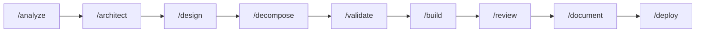
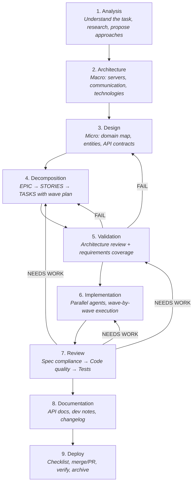
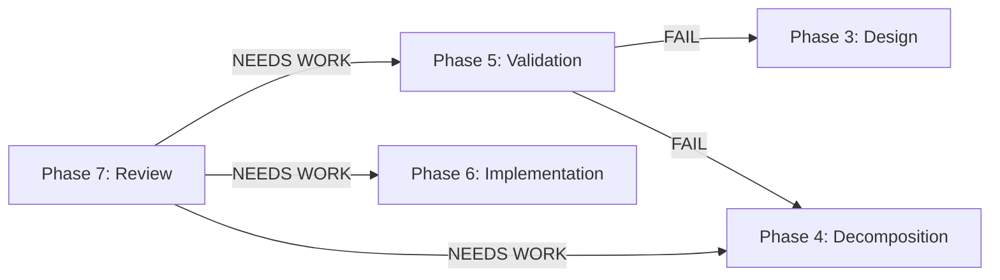
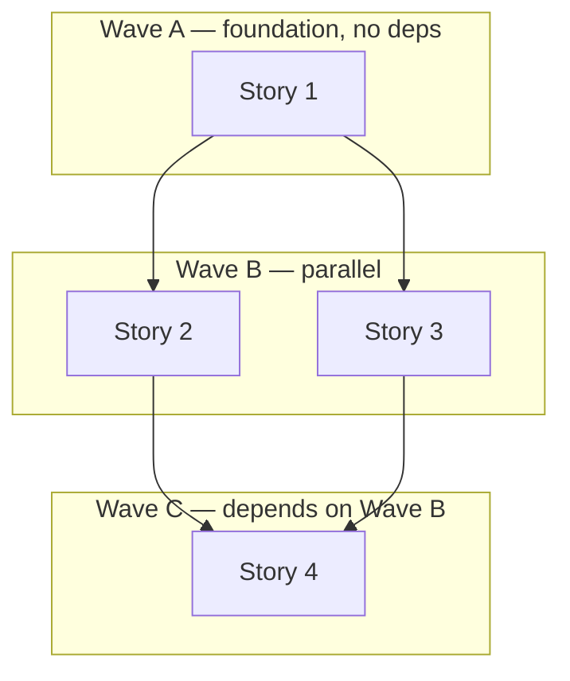

# Dev Pipeline

> 9-phase development workflow: from idea to deploy with manual approval gates at every step.



## Orchestrators

| File | Use When |
|------|----------|
| [workflow-full.md](workflow-full.md) | New project or major feature from scratch (greenfield) |
| [workflow-feature.md](workflow-feature.md) | Adding a feature to an existing project (brownfield) |

## The 9-Phase Pipeline



## Skills

| # | Phase | Skill | Command |
|---|-------|-------|---------|
| 1 | Analysis | [analysis/SKILL.md](skills/analysis/SKILL.md) | [/analyze](commands/analyze.md) |
| 2 | Architecture | [architecture/SKILL.md](skills/architecture/SKILL.md) | [/architect](commands/architect.md) |
| 3 | Design | [design/SKILL.md](skills/design/SKILL.md) | [/design](commands/design.md) |
| 4 | Decomposition | [decomposition/SKILL.md](skills/decomposition/SKILL.md) | [/decompose](commands/decompose.md) |
| 5 | Validation | [validation/SKILL.md](skills/validation/SKILL.md) | [/validate](commands/validate.md) |
| 6 | Implementation | [implementation/SKILL.md](skills/implementation/SKILL.md) | [/build](commands/build.md) |
| 7 | Review | [review/SKILL.md](skills/review/SKILL.md) | [/review](commands/review.md) |
| 8 | Documentation | [documentation/SKILL.md](skills/documentation/SKILL.md) | [/document](commands/document.md) |
| 9 | Deploy | [deploy/SKILL.md](skills/deploy/SKILL.md) | [/deploy](commands/deploy.md) |

## Agents

5 specialized sub-agents, each with a fresh context window:

| Agent | Role |
|-------|------|
| [**Implementer**](agents/implementer.md) | Implements a single story with sub-tasks |
| [**Researcher**](agents/researcher.md) | Deep research for analysis and architecture phases |
| [**Spec Reviewer**](agents/spec-reviewer.md) | Checks implementation matches design spec |
| [**Code Quality Reviewer**](agents/code-quality-reviewer.md) | Checks SOLID, security, performance, conventions |
| [**Test Writer**](agents/test-writer.md) | Writes unit and integration tests |

## Key Patterns

<details>
<summary><strong>Hard Gates</strong> — every phase requires explicit human approval</summary>

```xml
<HARD-GATE>
Wait for explicit approval before proceeding.
On approve → update STATE.md, move to next phase.
On reject → fix and re-present.
</HARD-GATE>
```

No phase can be skipped. No rationalization accepted.

</details>

<details>
<summary><strong>Anti-Rationalization Tables</strong> — prevent agents from cutting corners</summary>

Every skill includes a table of excuses the agent might generate and why each is invalid:

| Excuse | Reality |
|--------|---------|
| "This is too simple for analysis" | Simple features that touch external systems need analysis. |
| "Let's just start coding" | Architecture decisions made during coding are never revisited. |
| "We already use this pattern" | Confirm it applies here. Existing ≠ always correct. |

</details>

<details>
<summary><strong>Validation Loops</strong> — Phase 5 and 7 can loop back</summary>



Max 2 iterations per loop. After 2 failures, escalate to the user.

</details>

<details>
<summary><strong>Wave-Based Parallel Execution</strong> — stories run in parallel agents</summary>



Each agent gets a fresh context window — no context pollution between stories.

</details>
