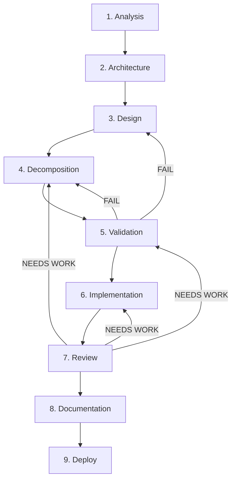

# Dev Pipeline — 9-Phase Development Workflow

A structured development workflow that takes a feature from idea to deployment through 9 phases with manual approval gates.

## Pipeline

## Orchestrators

| File | Use When |
|------|----------|
| [workflow-full.md](workflow-full.md) | New project or major feature from scratch (greenfield) |
| [workflow-feature.md](workflow-feature.md) | Adding a feature to an existing project (brownfield) |

## Skills (9 phases)

| # | Phase | Skill | Command |
|---|-------|-------|---------|
| 1 | Analysis | [analysis/SKILL.md](skills/analysis/SKILL.md) | [/analyze](commands/analyze.md) |
| 2 | Architecture | [architecture/SKILL.md](skills/architecture/SKILL.md) | [/architect](commands/architect.md) |
| 3 | Design | [design/SKILL.md](skills/design/SKILL.md) | [/design](commands/design.md) |
| 4 | Decomposition | [decomposition/SKILL.md](skills/decomposition/SKILL.md) | [/decompose](commands/decompose.md) |
| 5 | Validation | [validation/SKILL.md](skills/validation/SKILL.md) | [/validate](commands/validate.md) |
| 6 | Implementation | [implementation/SKILL.md](skills/implementation/SKILL.md) | [/build](commands/build.md) |
| 7 | Review | [review/SKILL.md](skills/review/SKILL.md) | [/review](commands/review.md) |
| 8 | Documentation | [documentation/SKILL.md](skills/documentation/SKILL.md) | [/document](commands/document.md) |
| 9 | Deploy | [deploy/SKILL.md](skills/deploy/SKILL.md) | [/deploy](commands/deploy.md) |

## Agents

| Agent | Role |
|-------|------|
| [implementer.md](agents/implementer.md) | Implements a single story with sub-tasks |
| [researcher.md](agents/researcher.md) | Deep research for analysis and architecture phases |
| [spec-reviewer.md](agents/spec-reviewer.md) | Checks implementation matches design spec |
| [code-quality-reviewer.md](agents/code-quality-reviewer.md) | Checks SOLID, security, performance, conventions |
| [test-writer.md](agents/test-writer.md) | Writes unit and integration tests |
