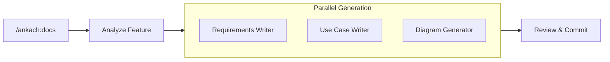

# Feature Docs

> 3-step parallel documentation pipeline: analyze, generate docs in parallel, review and commit.



## When to Use

Use this workflow when you need **documentation only** — no code implementation.

- Feature specification before development begins
- Analysis documents for stakeholder review
- Requirements and use cases for a planned feature
- Technical design documentation

If you need both documentation AND implementation, use [`dev-pipeline`](../dev-pipeline/) instead.

## Command

```
/ankach:docs Add invoice PDF generation for B2B orders
```

## The 3-Step Pipeline

| Step | Name | What Happens |
|------|------|-------------|
| 1 | **Analyze** | Read context, confirm stack, ask questions, lock understanding |
| 2 | **Generate (parallel)** | 3 agents run simultaneously: requirements, use cases, diagrams |
| 3 | **Review & Commit** | Validate all outputs, present to user, commit |

## Agents

3 specialized sub-agents, each spawned in parallel during Step 2:

| Agent | Role | Output |
|-------|------|--------|
| [**Requirements Writer**](agents/requirements-writer.md) | R001-R00N requirements with acceptance criteria and estimates | `requirements.md` |
| [**Use Case Writer**](agents/usecase-writer.md) | Actors, main flows, alternative flows, error flows | `use-cases.md` |
| [**Diagram Generator**](agents/diagram-generator.md) | Mermaid diagrams with syntax validation | `diagrams.md` |

## Output

```
.planning/active/docs-{slug}/
├── index.md              # Summary and links
├── analysis.md           # Context, understanding, approach
├── requirements.md       # R001-R00N format
├── use-cases.md          # Actor-based flows
└── diagrams.md           # Validated Mermaid diagrams
```
