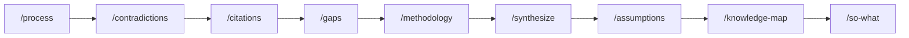
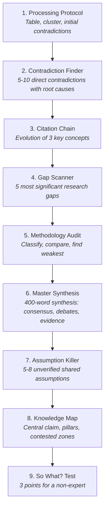

# Research Analysis

> 9-step systematic protocol for deep analysis of scientific papers and research literature. Load papers, find contradictions, trace concepts, audit methodology, and produce a knowledge map.



## Usage

```
# Run the full workflow:
/research-analysis

# Or run individual steps:
/process
```

## The 9-Step Pipeline



## Skills

| # | Step | Skill | Command | Output |
|---|------|-------|---------|--------|
| 1 | Processing Protocol | [SKILL.md](skills/processing-protocol/SKILL.md) | [/process](commands/process.md) | Paper table, clusters, contradictions |
| 2 | Contradiction Finder | [SKILL.md](skills/contradiction-finder/SKILL.md) | [/contradictions](commands/contradictions.md) | 5-10 contradictions with root causes |
| 3 | Citation Chain | [SKILL.md](skills/citation-chain/SKILL.md) | [/citations](commands/citations.md) | Evolution of 3 key concepts |
| 4 | Gap Scanner | [SKILL.md](skills/gap-scanner/SKILL.md) | [/gaps](commands/gaps.md) | 5 research gaps with resolution paths |
| 5 | Methodology Audit | [SKILL.md](skills/methodology-audit/SKILL.md) | [/methodology](commands/methodology.md) | Classification table, weakest methodology |
| 6 | Master Synthesis | [SKILL.md](skills/master-synthesis/SKILL.md) | [/synthesize](commands/synthesize.md) | 400-word synthesis across all papers |
| 7 | Assumption Killer | [SKILL.md](skills/assumption-killer/SKILL.md) | [/assumptions](commands/assumptions.md) | 5-8 unverified assumptions with risk levels |
| 8 | Knowledge Map | [SKILL.md](skills/knowledge-map/SKILL.md) | [/knowledge-map](commands/knowledge-map.md) | Central claim, pillars, contested zones |
| 9 | So What? Test | [SKILL.md](skills/so-what-test/SKILL.md) | [/so-what](commands/so-what.md) | 3-point summary for non-experts |

## Credits

Based on the research analysis protocol by [@kaisark_](https://www.instagram.com/kaisark_/).
